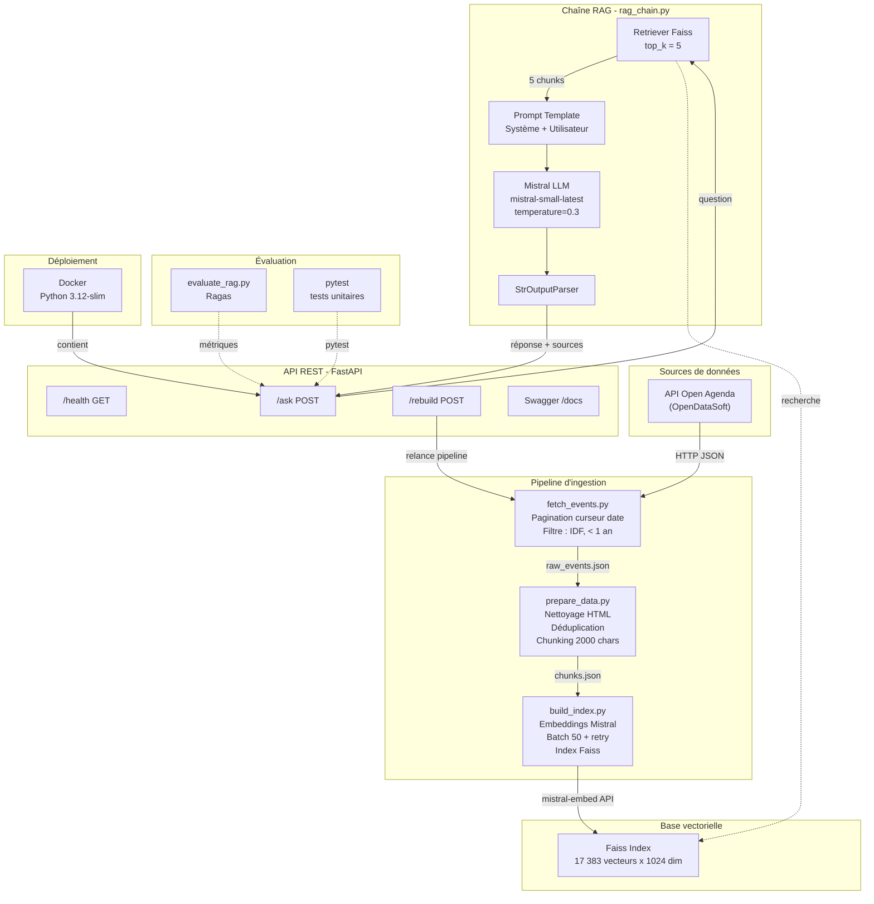

# Puls-Events — Chatbot RAG

POC d'un chatbot intelligent basé sur le **Retrieval-Augmented Generation (RAG)** pour recommander des événements culturels.

## Stack technique

| Composant | Technologie |
|-----------|------------|
| Orchestrateur RAG | LangChain |
| Modèle NLP | Mistral (via API) |
| Base vectorielle | Faiss (faiss-cpu) |
| API REST | FastAPI |
| Source de données | API Open Agenda |

| Conteneurisation | Docker |

## Architecture du système



> *Si le diagramme Mermaid ne s'affiche pas, voir l'image :*
>
> 

## Installation

### Option 1 — Docker (recommandé)

```bash
# Build de l'image
docker build -t puls-events .

# Lancer le conteneur (clé API chargée depuis .env)
docker run -p 8000:8000 --env-file .env puls-events
```

L'API est accessible sur `http://localhost:8000/docs`.

> **Note** : L'index Faiss doit être présent dans `data/faiss_index/` avant le build, ou reconstruit via `/rebuild` après le lancement.

Pour monter un index existant :
```bash
docker run -p 8000:8000 \
  --env-file .env \
  -v $(pwd)/data:/app/data \
  puls-events
```

### Option 2 — Installation locale

### 1. Cloner le projet

```bash
git clone <url-du-repo>
cd pull-events
```

### 2. Créer un environnement virtuel

```bash
python -m venv env
source env/bin/activate
```

### 3. Installer les dépendances

```bash
pip install -r requirements.txt
```

### 4. Configurer les variables d'environnement

```bash
cp .env.example .env
# Éditer .env et renseigner votre clé API Mistral
```

### 5. Vérifier l'installation

```bash
python scripts/check_imports.py
```

## Lancement rapide (script complet)

```bash
chmod +x launch.sh
./launch.sh           # Pipeline complet + API
./launch.sh --api     # API seule (index existant)
```

## Lancer l'API

```bash
source .env && uvicorn api.main:app --reload
```

L'API est accessible sur `http://localhost:8000`.

### Documentation Swagger

Une documentation interactive est générée automatiquement :
- **Swagger UI** : http://localhost:8000/docs
- **ReDoc** : http://localhost:8000/redoc

### Endpoints

| Méthode | Endpoint | Description |
|---------|----------|-------------|
| GET | `/health` | Vérifier l'état de l'API |
| POST | `/ask` | Poser une question au chatbot |
| POST | `/rebuild` | Reconstruire l'index Faiss |

#### Exemple — POST /ask

```bash
curl -X POST http://localhost:8000/ask \
  -H "Content-Type: application/json" \
  -d '{"question": "Quels concerts à Paris ce weekend ?"}'
```

Réponse :
```json
{
  "answer": "Voici les concerts prévus à Paris...",
  "sources": [
    {
      "title": "Concert Jazz au Sunset",
      "city": "Paris",
      "date_start": "2026-03-28",
      "date_end": "2026-03-28",
      "url": "https://openagenda.com/...",
      "excerpt": "Un concert exceptionnel..."
    }
  ]
}
```

## Tests

```bash
pytest tests/ -v
```

Le projet contient **2 suites de tests** :
- `tests/test_api.py` — 12 tests pour l'API REST (endpoints, erreurs, Swagger)
- `tests/test_scripts.py` — 20 tests pour les scripts du pipeline (nettoyage, chunking, fetch, indexation, RAG)

## Évaluation RAG (Ragas)

```bash
python scripts/evaluate_rag.py
```

Le script évalue le pipeline RAG sur un jeu de test annoté (`data/test_questions.json`, 5 questions) et calcule les métriques :

| Métrique | Ce qu'elle mesure |
|----------|------------------|
| **Faithfulness** | Le LLM reste fidèle aux chunks (pas d'hallucination) |
| **Response Relevancy** | La réponse est pertinente par rapport à la question |
| **Context Precision** | Les bons chunks sont récupérés par Faiss |

Les résultats sont sauvegardés dans `data/evaluation_results.json`.

## Limites connues et améliorations possibles

### Limites du POC

- **Volumétrie** : ~16 000 événements Île-de-France. Pas testé à l'échelle nationale.
- **Fraîcheur des données** : l'index doit être reconstruit manuellement ou via `/rebuild` pour intégrer les nouveaux événements.
- **Pas d'historique de conversation** : chaque question est indépendante (pas de mémoire de session).
- **Dépendance API Mistral** : en cas d'indisponibilité de l'API Mistral, le chatbot et le rebuild sont bloqués.
- **Coût API** : chaque rebuild nécessite ~17 000 appels d'embedding (coût à surveiller en production).
- **Mono-langue** : le système est optimisé pour le français uniquement.

### Améliorations possibles

- **Mise à jour incrémentale** : ne re-vectoriser que les nouveaux événements au lieu de tout reconstruire.
- **Historique de conversation** : ajouter une mémoire LangChain pour les échanges multi-tours.
- **Cache de réponses** : éviter de rappeler le LLM pour des questions identiques.
- **Filtres métadonnées** : permettre de filtrer par ville, date ou type d'événement directement dans la requête.
- **Passage en production** : déploiement sur un VPS OVH avec HTTPS, rate-limiting et monitoring.

## Pipeline de données

```bash
# 1. Ingestion (API Open Agenda → data/raw_events.json)
python scripts/fetch_events.py

# 2. Nettoyage + chunking (→ data/chunks.json)
python scripts/prepare_data.py

# 3. Indexation Faiss (→ data/faiss_index/)
python scripts/build_index.py
```

## Structure du projet

```
pull-events/
├── api/                       # API REST FastAPI
│   └── main.py                # Endpoints /ask, /rebuild, /health
├── scripts/                   # Scripts du pipeline
│   ├── fetch_events.py        # Ingestion Open Agenda
│   ├── prepare_data.py        # Nettoyage + chunking
│   ├── build_index.py         # Indexation Faiss
│   ├── rag_chain.py           # Chaîne RAG (retriever + LLM)
│   ├── evaluate_rag.py        # Évaluation Ragas
│   └── check_imports.py       # Vérification de l'environnement
├── tests/                     # Tests unitaires
│   ├── test_api.py            # Tests de l'API (12 tests)
│   └── test_scripts.py        # Tests du pipeline (20 tests)
├── data/                      # Données (non versionnées sauf test)
│   └── test_questions.json    # Jeu de test annoté
├── docs/                      # Documentation
├── launch.sh                  # Script de lancement complet
├── Dockerfile                 # Conteneurisation
├── .dockerignore
├── .env.example               # Template des variables d'environnement
├── .gitignore
├── README.md
└── requirements.txt
```
