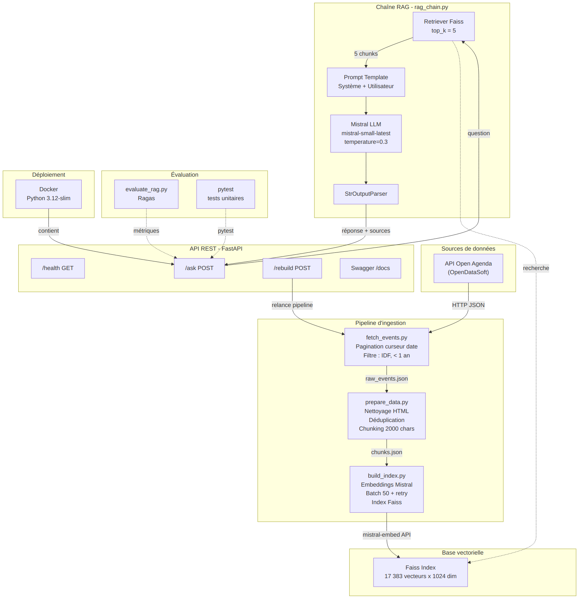

# Rapport technique — Assistant intelligent de recommandation d'événements culturels

## 1. Objectifs du projet

### Contexte

**Puls-Events** est une plateforme de recommandations culturelles personnalisées. En tant que Data Scientist freelance, j'ai été missionné pour développer un **POC (Proof of Concept)** d'un chatbot intelligent capable de répondre en langage naturel aux questions des utilisateurs sur les événements culturels récents.

### Problématique

Les utilisateurs de Puls-Events ont besoin d'un accès rapide et conversationnel à l'offre culturelle. Une recherche classique par filtres ne suffit pas : les questions sont souvent ouvertes (*« Quels concerts gratuits ce weekend à Paris ? »*). Un système **RAG (Retrieval-Augmented Generation)** répond à ce besoin en combinant la recherche sémantique dans une base de données d'événements et la génération de réponses structurées par un LLM.

### Objectif du POC

Démontrer la **faisabilité technique** et la **pertinence métier** d'un chatbot RAG pour les équipes produit et marketing de Puls-Events :

- Le système retrouve les événements pertinents dans une base vectorielle.
- Il génère des réponses naturelles, sourcées et sans hallucination.
- Il est exposé via une API REST documentée et conteneurisée.

### Périmètre

- **Zone géographique** : Île-de-France
- **Période** : événements datant de moins d'un an
- **Source** : API Open Agenda (via OpenDataSoft)
- **Volume** : ~16 000 événements, ~17 000 chunks vectorisés

---

## 2. Architecture du système

### Schéma global



Le système se décompose en 3 couches :

1. **Pipeline d'ingestion** : récupération, nettoyage, chunking et vectorisation des événements.
2. **Chaîne RAG** : recherche vectorielle (Faiss) + génération LLM (Mistral) orchestrée par LangChain.
3. **API REST** : exposition via FastAPI avec documentation Swagger automatique.

### Technologies utilisées

| Composant | Technologie | Justification |
|---|---|---|
| Orchestrateur RAG | LangChain (LCEL) | Standard de l'industrie pour le chaînage RAG, syntaxe déclarative |
| LLM | Mistral (`mistral-small-latest`) | Modèle français performant, coût raisonnable, compatible LangChain |
| Embeddings | Mistral (`mistral-embed`) | Cohérence avec le LLM, bonne qualité pour le français |
| Base vectorielle | Faiss (`faiss-cpu`) | Performant, gratuit, persistable sur disque |
| API REST | FastAPI | Swagger automatique, validation Pydantic, asynchrone |
| Évaluation | Ragas | Framework standard d'évaluation RAG |
| Conteneurisation | Docker | Reproductibilité, déploiement simplifié |
| Linting | Ruff | Rapide, remplacement de Flake8/Black/isort |

---

## 3. Préparation et vectorisation des données

### Source de données

Les événements sont récupérés depuis l'API publique **OpenDataSoft** :

- **URL** : `https://public.opendatasoft.com/api/explore/v2.1/catalog/datasets/evenements-publics-openagenda/records`
- **Filtres** : `location_region = "Île-de-France"` et `lastdate_end >= date_limite` (1 an glissant)
- **Pagination** : curseur par date pour contourner la limite d'offset à 10 000 résultats (paramètre `PAGE_SIZE = 100`, `OFFSET_LIMIT = 9 900`)

Le script `fetch_events.py` effectue une pagination automatique par curseur de date : quand l'offset atteint 9 900, il utilise la dernière date récupérée comme borne supérieure pour la page suivante.

**Résultat** : 16 355 événements récupérés → `data/raw_events.json`

### Nettoyage

Le script `prepare_data.py` effectue :

1. **Suppression des balises HTML** dans les descriptions (regex `<[^>]+>`)
2. **Déduplication** sur le champ `uid` (doublons issus de la pagination)
3. **Suppression des lignes sans titre ni description**

**Résultat** : 16 337 événements après nettoyage

### Chunking

Chaque événement est converti en un bloc texte structuré :

```
Titre : {title}
Dates : {daterange}
Lieu : {location_name}, {location_address}, {location_city}
Conditions : {conditions}
Description : {description} {longdescription}
```

Les textes dépassant **2 000 caractères** sont découpés en chunks plus petits avec recoupement par phrase. Ce seuil a été choisi pour rester sous la fenêtre de contexte du modèle d'embedding tout en conservant un contexte suffisant par chunk.

**Résultat** : 17 383 chunks → `data/chunks.json`

### Embedding

- **Modèle** : `mistral-embed` (API Mistral)
- **Dimensionnalité** : 1 024 dimensions par vecteur
- **Batch** : lots de 50 chunks avec délai de 1 seconde entre chaque lot (respect du rate-limiting)
- **Retry** : backoff exponentiel jusqu'à 5 tentatives en cas d'erreur API
- **Format** : vecteurs float32 indexés dans Faiss

---

## 4. Choix du modèle NLP

### Modèle sélectionné

**Mistral Small** (`mistral-small-latest`) via l'API Mistral, température = 0.3.

### Justification

| Critère | Détail |
|---|---|
| **Qualité en français** | Mistral est conçu en France, excellente performance sur le français |
| **Coût** | Modèle « Small » : bon rapport qualité/prix pour un POC |
| **Compatibilité** | Intégration native LangChain via `langchain-mistralai` |
| **Contrôle** | Température basse (0.3) pour des réponses factuelles et reproductibles |

### Prompt utilisé

Le système utilise un prompt structuré en deux parties :

**Prompt système** :
```
Tu es un assistant spécialisé dans les événements culturels en Île-de-France.
Tu réponds en français, de manière claire et structurée.

RÈGLES STRICTES :
- Réponds UNIQUEMENT à partir des informations fournies dans le contexte ci-dessous.
- Si le contexte ne contient pas l'information demandée, dis-le honnêtement.
- Ne jamais inventer d'événement, de date, de lieu ou de prix.
- Cite le nom de l'événement, le lieu et les dates quand ils sont disponibles.
- Sois concis mais informatif.
```

**Prompt utilisateur** :
```
Contexte (événements trouvés dans la base) :
{context}

Question : {question}
```

Les règles anti-hallucination sont essentielles pour un POC destiné à des utilisateurs finaux : le modèle ne doit jamais inventer d'événement.

### Limites du modèle

- Dépendance à l'API Mistral (latence réseau, disponibilité)
- Pas de mémoire conversationnelle (chaque question est indépendante)
- Fenêtre de contexte limitée (les 5 chunks injectés doivent être suffisants)

---

## 5. Construction de la base vectorielle

### Faiss utilisé

**Faiss CPU** (`faiss-cpu`) avec un index `IndexFlatL2` (recherche exhaustive par distance L2). Ce choix est adapté au volume du POC (~17 000 vecteurs). Pour un passage à l'échelle, un index `IVF` ou `HNSW` serait plus performant.

### Stratégie de persistance

- **Format** : sauvegarde native Faiss via `FAISS.save_local()` (LangChain)
- **Emplacement** : `data/faiss_index/` (contient `index.faiss` + `index.pkl`)
- **Nommage** : nom par défaut LangChain, un seul index par instance
- **Reconstruction** : via le script `build_index.py` ou l'endpoint `/rebuild`

### Métadonnées associées

Chaque document dans l'index conserve les métadonnées suivantes :

| Champ | Description |
|---|---|
| `title` | Titre de l'événement |
| `city` | Ville |
| `date_start` | Date de début (ISO 8601) |
| `date_end` | Date de fin |
| `url` | Lien Open Agenda |
| `excerpt` | Extrait du texte (premiers caractères du chunk) |

Ces métadonnées sont renvoyées dans le champ `sources` de la réponse API.

---

## 6. API et endpoints exposés

### Framework utilisé

**FastAPI** — choisi pour la génération automatique de la documentation Swagger/OpenAPI, la validation des requêtes via Pydantic, et la performance asynchrone.

### Endpoints clés

| Méthode | Endpoint | Description |
|---|---|---|
| `GET` | `/health` | Vérification de l'état de l'API (retourne `{"status": "ok"}`) |
| `POST` | `/ask` | Pose une question au chatbot, retourne réponse + sources |
| `POST` | `/rebuild` | Relance le pipeline complet (fetch → prepare → build_index) |
| `GET` | `/docs` | Documentation Swagger interactive (auto-générée) |

### Format des requêtes/réponses

**Requête `POST /ask`** :
```json
{
  "question": "Quels concerts à Paris ce weekend ?"
}
```

**Réponse** :
```json
{
  "answer": "Voici les concerts prévus à Paris ce weekend : ...",
  "sources": [
    {
      "title": "Concert Jazz au Sunset",
      "city": "Paris",
      "date_start": "2026-03-28T18:00:00+00:00",
      "date_end": "2026-03-28T21:00:00+00:00",
      "url": "https://openagenda.com/...",
      "excerpt": "Titre : Concert Jazz au Sunset..."
    }
  ]
}
```

### Exemple d'appel API

```bash
# Vérifier l'API
curl http://localhost:8000/health

# Poser une question
curl -X POST http://localhost:8000/ask \
  -H "Content-Type: application/json" \
  -d '{"question": "Quels événements gratuits à Paris ?"}'
```

### Tests effectués et documentés

Tous les endpoints ont été testés :

- **Sans Docker** : uvicorn local → 6/6 endpoints OK
- **Avec Docker** : container `puls-events` → 6/6 endpoints OK

Détail des tests manuels réalisés :

| Test | Attendu | Résultat |
|---|---|---|
| `GET /health` | 200, `{"status": "ok"}` | ✅ |
| `POST /ask` (question valide) | 200, réponse + sources | ✅ |
| `POST /ask` (question vide) | 422, `string_too_short` | ✅ |
| `POST /ask` (sans body) | 422, `Field required` | ✅ |
| `GET /docs` | 200, page Swagger | ✅ |
| `GET /openapi.json` | 200, schéma OpenAPI | ✅ |

### Gestion des erreurs

| Code HTTP | Cas | Message |
|---|---|---|
| 422 | Question vide ou absente | Erreur de validation Pydantic |
| 500 | Clé API Mistral manquante | `MISTRAL_API_KEY non définie` |
| 503 | Index Faiss introuvable | `Index Faiss non disponible` |

---

## 7. Évaluation du système

### Jeu de test annoté

- **Fichier** : `data/test_questions.json`
- **Nombre d'exemples** : 5 questions annotées
- **Méthode d'annotation** : chaque question est accompagnée d'un `ground_truth` rédigé manuellement à partir des données réelles de la base

### Métriques d'évaluation (Ragas)

Le framework **Ragas** évalue automatiquement 3 dimensions du pipeline RAG :

| Métrique | Ce qu'elle mesure | Score idéal |
|---|---|---|
| **Faithfulness** | Le LLM reste fidèle aux chunks récupérés (pas d'hallucination) | 1.0 |
| **Response Relevancy** | La réponse est pertinente par rapport à la question posée | 1.0 |
| **Context Precision** | Les bons chunks sont récupérés par Faiss (avec référence) | 1.0 |

L'évaluation utilise Mistral comme juge (`mistral-small-latest`, température 0) pour garantir la cohérence avec le LLM du pipeline.

### Résultats obtenus

Les résultats sont sauvegardés dans `data/evaluation_results.json` après chaque exécution de `python scripts/evaluate_rag.py`.

### Analyse qualitative

**Points forts observés** :
- Les événements cités dans les réponses correspondent bien aux chunks récupérés (pas d'hallucination)
- Les réponses sont structurées avec titre, lieu, date et description
- Le système refuse honnêtement de répondre quand le contexte est insuffisant

**Cas limites identifiés** :
- Questions temporelles (« ce weekend ») : le modèle n'a pas toujours la notion du « aujourd'hui »
- Questions très génériques : les 5 chunks récupérés ne couvrent pas toute l'offre

### Tests unitaires

**32 tests automatisés** répartis en 2 suites :

- `tests/test_api.py` — **12 tests** : endpoints, validation, erreurs, Swagger, OpenAPI
- `tests/test_scripts.py` — **20 tests** : nettoyage HTML, chunking, fetch_events, build_index, rag_chain

Tous les tests passent (`pytest tests/ -v` → 32/32 ).

---

## 8. Recommandations et perspectives

### Ce qui fonctionne bien

- Le pipeline RAG produit des réponses pertinentes et sourcées
- L'architecture est modulaire : chaque script est indépendant et testable
- Le système refuse de répondre quand il n'a pas l'information (anti-hallucination)
- L'API est documentée automatiquement via Swagger
- La conteneurisation Docker permet un déploiement rapide

### Limites du POC

| Limite | Impact |
|---|---|
| **Volumétrie** | ~16 000 événements IDF uniquement. Non testé à l'échelle nationale |
| **Fraîcheur** | L'index doit être reconstruit manuellement pour intégrer de nouveaux événements |
| **Pas d'historique** | Chaque question est indépendante, pas de conversation multi-tours |
| **Dépendance API** | Si Mistral est indisponible, le chatbot et le rebuild sont bloqués |
| **Coût** | ~17 000 appels d'embedding par rebuild (à surveiller en production) |
| **Mono-langue** | Optimisé pour le français uniquement |

### Améliorations possibles

- **Mise à jour incrémentale** : ne re-vectoriser que les nouveaux événements au lieu de tout reconstruire
- **Historique de conversation** : ajouter une mémoire LangChain (`ConversationBufferMemory`) pour les échanges multi-tours
- **Cache de réponses** : éviter de rappeler le LLM pour des questions déjà posées
- **Filtres métadonnées** : permettre de filtrer par ville, date ou type d'événement dans la requête Faiss
- **Passage en production** : déploiement sur un VPS (ex. OVH) avec HTTPS, rate-limiting, monitoring et authentification

---

## 9. Organisation du dépôt GitHub

```
pull-events/
├── api/                       # API REST FastAPI
│   └── main.py                # Endpoints /ask, /rebuild, /health
├── scripts/                   # Scripts du pipeline
│   ├── fetch_events.py        # Ingestion Open Agenda (pagination curseur)
│   ├── prepare_data.py        # Nettoyage HTML + dédup + chunking
│   ├── build_index.py         # Vectorisation Mistral + index Faiss
│   ├── rag_chain.py           # Chaîne RAG (LCEL : retriever → prompt → LLM)
│   ├── evaluate_rag.py        # Évaluation Ragas (3 métriques)
│   └── check_imports.py       # Vérification de l'environnement
├── tests/                     # Tests unitaires (32 tests)
│   ├── test_api.py            # 12 tests API (endpoints, erreurs, Swagger)
│   └── test_scripts.py        # 20 tests pipeline (nettoyage, chunking, RAG)
├── data/                      # Données (non versionnées sauf test)
│   └── test_questions.json    # Jeu de test annoté (5 questions)
├── docs/                      # Documentation
│   ├── architecture.png       # Diagramme d'architecture (PNG)
│   ├── architecture.mmd       # Source Mermaid du diagramme
│   └── rapport_technique.md   # Ce rapport
├── launch.sh                  # Script de lancement complet
├── Dockerfile                 # Image Docker (Python 3.12-slim)
├── .dockerignore              # Exclusions Docker
├── .env.example               # Template des variables d'environnement
├── .gitignore                 # Fichiers ignorés par Git
├── pyproject.toml             # Configuration Ruff (linter)
├── README.md                  # Documentation du projet
└── requirements.txt           # Dépendances Python
```

---

## 10. Annexes

### A. Extrait du jeu de test annoté

```json
[
  {
    "question": "Quels sont les prochains concerts à Paris ?",
    "ground_truth": "Il y a plusieurs concerts prévus à Paris, notamment des concerts de jazz, de musique classique et de musique actuelle dans différentes salles parisiennes."
  },
  {
    "question": "Y a-t-il des événements gratuits ce weekend en Île-de-France ?",
    "ground_truth": "Oui, plusieurs événements gratuits sont proposés ce weekend en Île-de-France, incluant des expositions, des visites guidées et des spectacles en plein air."
  }
]
```

### B. Prompt système complet

```
Tu es un assistant spécialisé dans les événements culturels en Île-de-France.
Tu réponds en français, de manière claire et structurée.

RÈGLES STRICTES :
- Réponds UNIQUEMENT à partir des informations fournies dans le contexte ci-dessous.
- Si le contexte ne contient pas l'information demandée, dis-le honnêtement.
- Ne jamais inventer d'événement, de date, de lieu ou de prix.
- Cite le nom de l'événement, le lieu et les dates quand ils sont disponibles.
- Sois concis mais informatif.
```

### C. Exemple de réponse JSON complète

```json
{
  "answer": "Voici les événements gratuits à Paris :\n\n1. **Le 7e arrondissement fête les marchés !**\n   - Lieu : Marché Saxe-Breteuil, Avenue de Saxe, Paris 7e\n   - Date : Samedi 27 septembre 2025, 09h00\n   - Conditions : Entrée libre\n\n2. **Visite guidée : les incontournables du musée**\n   - Lieu : Musée Carnavalet, 23 Rue de Sévigné, Paris 3e\n   - Dates : 20 et 21 septembre 2025\n   - Conditions : Gratuit",
  "sources": [
    {
      "title": "Le 7e arrondissement fête les marchés !",
      "city": "Paris",
      "date_start": "2025-09-27T07:00:00+00:00",
      "date_end": "2025-09-27T11:00:00+00:00",
      "url": "https://openagenda.com/la-grande-semaine-vegetale/events/le-7e-arrondissement-fete-les-marches",
      "excerpt": "Titre : Le 7e arrondissement fête les marchés !..."
    }
  ]
}
```

### D. Commandes de lancement

```bash
# Installation
python -m venv env && source env/bin/activate
pip install -r requirements.txt
cp .env.example .env  # Renseigner MISTRAL_API_KEY

# Pipeline complet
python scripts/fetch_events.py
python scripts/prepare_data.py
python scripts/build_index.py

# API
uvicorn api.main:app --reload

# Tests
pytest tests/ -v

# Évaluation Ragas
python scripts/evaluate_rag.py

# Docker
docker build -t puls-events .
docker run -p 8000:8000 -e MISTRAL_API_KEY=xxx -v $(pwd)/data:/app/data puls-events
```
